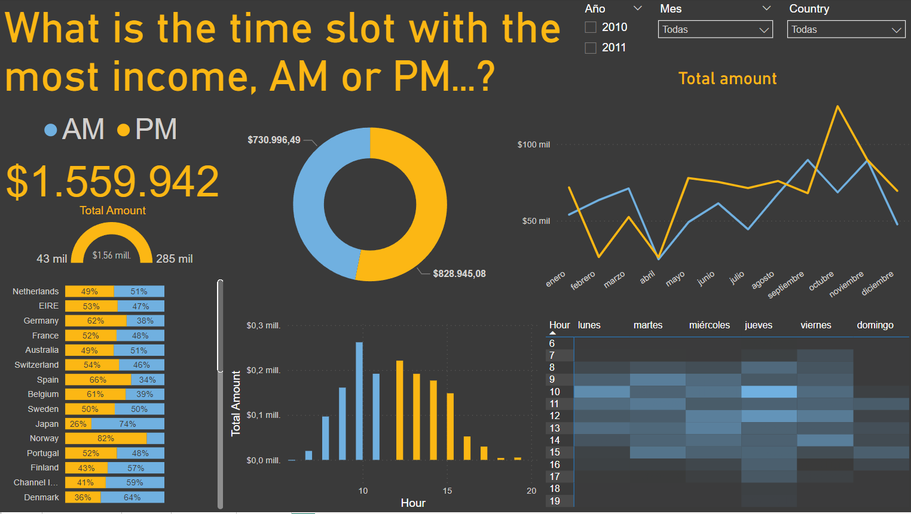
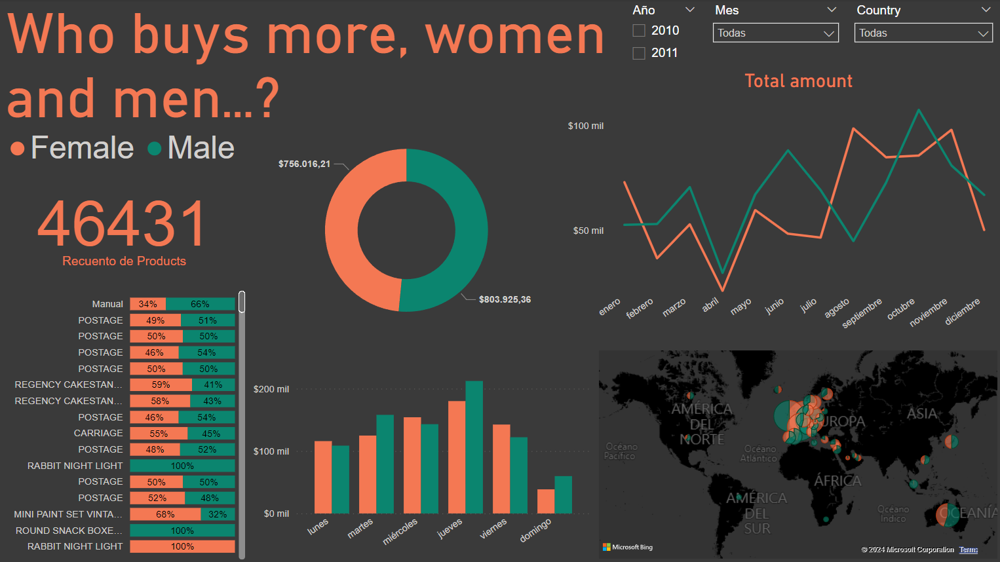
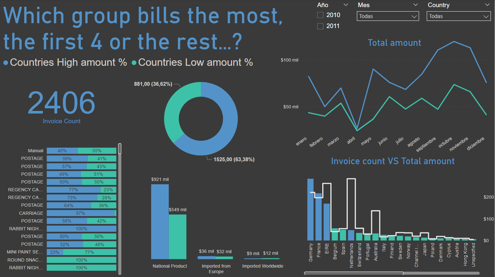
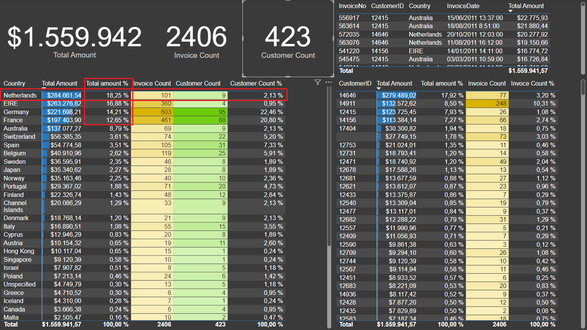
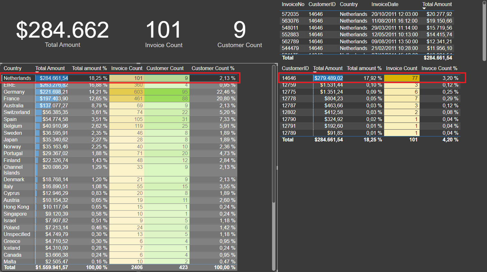

   # **Proyecto exploración y visualización de datos**

### Exploración y visualización de Dataset de E-Commerce - Maximo Lloris Salvi


## Origen de los datos

Desarrollo la práctica y el análisis de los datos sobre un Dataset que recoge las transacciones de un **E-Commerce**.

**Link:** [Dataset E-Commerce](https://www.kaggle.com/datasets/carrie1/ecommerce-data/data/)


En base a estos datos y utilizando distintas funciones de DAX, he procedido a la obtención de más columnas y medidas calculadas que nos permitirán, más adelante, plantear distintos KPI a los cuales daré respuesta en los distintos Dashboards.


## Transformación manual de los datos

Las columnas InvoiceNO, StockCODE, Description los dejamos tal y como nos vienen de origen.
Para la columna Quantity le indicamos que se trata de un entero.
La columna InvoiceData le cambiamos el tipo y seleccionamos la configuración regional de origen.
Para la columna de UnitPrice, sustituimos el punto que define el decimal y lo sustituimos por coma para poder hacer la conversión a número decimal.
El resto de columnas las dejamos tal y como vienen, salvo la columna de **Country** sobre la cual aplicamos un filtro para excluir al Reino Unido por ciertos problemas que daban los registros que contenían este país, tal y como se indicaba en las especificaciones de la data set.


## Obtención de más columnas

### Fecha

Las primeras columnas adicionales que he obtenido ha sido la de las siguientes:

Hour

```
Hour = HOUR('Invoice data'[InvoiceDate])
```

Hour Group
```
Hour Group = IF ('Invoice data'[Hour] < 12, "AM", "PM")
```

Day
```
Day = WEEKDAY('Invoice data'[InvoiceDate], 2)
```
Nota: el 2 responde al segundo parámetro de la función WEEKDAY en el cual hay que especificar cual es el primer dia de la semana.


Day of Week
```
Day of Week = FORMAT( 'Invoice data'[InvoiceDate], "DDDD")
```
Nota: el segundo parámetro “DDDD” hace referencia a la forma en la que queremos visualizar el dia de la semana. En este caso, esta es la sintaxis para el nombre completo del día, Lunes por ejemplo.


### Categoría del producto

Con esta categoría establecemos en función del código del producto, si se trata de un producto nacional o de origen importado.
Para este ejercicio se define como producto importado todo aquel que tenga un StockCode con un LEN superior a 5.
Para mayor clasificación se definen otro criterio que indicara el origen de aquellos productos que han sido importados. "Imported from Europe" o "Imported Worldwide" en función de la última letra del StockCode

Con estos dos criterios calculamos y obtenemos las siguientes dos columnas:

Stock Category
```
Stock Category = IF(

RIGHT('Invoice data'[StockCode], 1) = "A" ||

RIGHT('Invoice data'[StockCode], 1) = "B" ||

RIGHT('Invoice data'[StockCode], 1) = "C",

"Imported from Europe",

IF(

RIGHT('Invoice data'[StockCode], 1) = "D" ||

RIGHT('Invoice data'[StockCode], 1) = "E" ||

RIGHT('Invoice data'[StockCode], 1) = "F" ||

RIGHT('Invoice data'[StockCode], 1) = "G",

"Imported Worldwide", "National Product"
))
```
Nota: Con la función RIGHT aplicada sobre una columna e indicando la posición del elemento obtenemos el primer elemento de cada StockCode y comprobamos si cumple la condición booleana.


Stock Category 2
```
Stock Category 2 = IF (LEN('Invoice data'[StockCode]) > 5, "Imported Product", "National Product")
```

### Categoría por género

Para este ejercicio establecemos la condición que determina el género del cliente en función de que el último elemento del CustomerID sea par o impar
Customer Gener
```
Customer Gener = IF(MOD((CONVERT(RIGHT('Invoice data'[InvoiceNo], 1), INTEGER)), 2) = 0, "Female", "Male")
```
 
### Agrupación de países

Agrupamos a los países en dos categorías. Aquellos que tiene mas de un 10% de las ventas totales los incluimos en la categoría “Countries High amount %” y el resto de países con porcentajes inferiores en la categoría “Countries Low amount %”. Para ello utilizamos la función de agrupación de propio Power BI


## Creación de tabla para medidas adicionales

Para llevar a cabo medidas adicionales necesarias para contestar a las nuevas columnascreo una nueva tabla DAX medidas para poder recogerlas.
Algunas de estas medidas, se han obtenido y aplicado sobre gráficos que finalmente muestro y otras finalmente no se han utilizado, pero aun así las mantengo por que pueden ser requeridas en cualquier momento si se amplía el alcance de los Dashboards.
```
Customer Count = DISTINCTCOUNT('Invoice data'[CustomerID])

Customer Count % = [Customer Count] / CALCULATE([Customer Count], ALL('Invoice data'))

Invoice Count = DISTINCTCOUNT('Invoice data'[InvoiceNo])

Invoice Count = DISTINCTCOUNT('Invoice data'[InvoiceNo])

National Product $ = CALCULATE([Total Amount], 'Invoice data'[Stock Category] = "National Product")

National Producto % = [National Product $] / [Total Amount]

Total Amount = SUMX('Invoice data', [Quantity] * [UnitPrice])

Total amount % = [Total Amount] / CALCULATE([Total Amount], ALL('Invoice data'))

Unit Price Average = AVERAGE('Invoice data'[UnitPrice])
```

## Dashboards
### What is the time slot with the most income, AM or PM...?



En el primer Dashboard doy respuesta a la pregunta de, “¿En franja horaria se factura más?
Los gráficos planteados en este dashboard responden a dicha pregunta de distintas maneras,
permitiendo la segmentación y el análisis de los datos en mayor profundidad dependiendo de
los parámetros de consulta que queramos trasladarle.

El panel incluye una gráfica que nos traslada como valor mínimo la media de facturación de
todos los países y como valor máximo, la facturación total del país que más ha facturado.


### Who buys more, women and men...?



En el segundo dashboard resolvemos la pregunta que encabeza el panel pudiendo ver las
diferencias entre las compras realizadas por mujeres respecto de las compras realizadas por
los hombres.

Podemos analizar los productos que consumen con mayor frecuencia cualquier de los dos
géneros. También incluye un mapa de forma que podamos trasladar la consulta sobre los
hábitos de consumo a la geolocalización de los sujetos de estudio pudiendo de esta forma
concretar por países nuestra consulta.


### Which group bills the most, the first 4 or the rest...?



Por último, en este dashboard hemos agrupado los países de forma que tenemos en el primer
grupo aquellos 4 países los cuales son los únicos que han facturado por si solos mas del 10% de
la facturación total de todos los países juntos.


### Tablas de apoyo previo

Para poder llevar a cabo este dashboard, me apoye previamente en las medidas obtenidas de
la tabla DAX medidas. Estas medidas, pudieron permitirme observar datos relevantes los
cuales considero importante tener en cuenta.

Un dato que me parece remarcable es que el país con mayor facturación es Netherlands, el
cual alcanza, el puesto mas alto en el rankin, a pesar de tener menos muchas menos facturas
que los otros 3 países que forman el grupo “Countries Hight amount %”.

Netherlands, factura el 18,25% del total da la facturación y lo hace únicamente con un total de
101 facturas y 9 clientes. Comparando estos datos con los datos, por ejemplo de Germany, nos
damos cuenta que este ultimo se queda $60.000 por debajo de la facturación de Netherlands,
a pesar de tener mas de 6 veces más facturas emitidas y mas de 10 veces más clientes.



He considerado muy vital la información aportada por las tablas de la pestaña “Tablas de
estudio” pues con la ayuda de la visualización directa de los datos de facturación y valores
porcentuales, así como la asignación de formatos condicionales a las distintas columnas, he
podido comprender la relevación de los datos.

Sin estas tablas, hubiese sido muy complicado darme cuenta de esta relación de los distintos
países respecto a la facturación total.

Otro dato a señalar, es que uno de los 9 clientes de Netherlands, superar por si solo, la
facturación total del resto de países, manejando un volumen total de ventas del 17,92%.



La información que han aportado las tablas de estudio ha sido crucial para poder desarrollar
los dashboars y poder obtener información de ellos.
